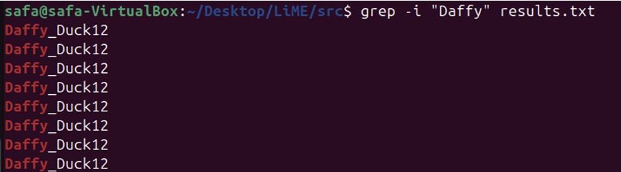

# System Forensics Project

**Author:** Safa Muhammad Ali  
**Course:** CSEC 140.602 – System Forensics  
**Institution:** RIT Dubai  
**Date:** 2026  

---

## Project Overview

This project demonstrates practical system forensics skills through hands-on tasks. The workflows cover:

1. Forensic file creation and integrity verification.  
2. Forensic deletion of files to prevent recovery.  
3. RAM (volatile memory) acquisition and analysis.  
4. USB drive imaging and recovery.  
5. Detecting and analyzing suspicious USB devices.

**Tools Used:**
- LiME (Linux Memory Extractor)  
- FTK Imager  
- xxd, dd, md5sum  
- USBDeview  
- Nano text editor  

---

## Workflow & Figures

### 1. Forensically Copying Files (Comparison)

**Figure 1a:** Creating a text file `group6_.txt` using `nano`.  
  
**Step-by-step:**
- Open terminal and type `nano group6_.txt` to create a new text file.  
- Enter some text content in the file and save it using `Ctrl+O` then `Ctrl+X`.  

**Figure 1b:** Inserting content into `group6_.txt`.  
  
**Step-by-step:**
- Edit the file to add additional content or modify existing content.  
- Save the changes with `Ctrl+O` and exit with `Ctrl+X`.  

**Figure 1c:** Copying with `cp` (normal copy).  
  
**Step-by-step:**
- Command: `cp group6_.txt copyfile.txt`  
- This is a normal copy and works for general use but may not preserve metadata or guarantee forensic integrity.

**Figure 1d (dd):** Copying with `dd` (forensic copy).  
  
**Step-by-step:**
- Command: `dd if=group6_.txt of=copy.dd`  
- This performs a **byte-by-byte copy**, preserving the exact file content for forensic purposes.

**Figure 1e:** Verifying integrity using `md5sum`.  
  
**Step-by-step:**
- Command: `md5sum group6_.txt copy.dd`  
- Confirm that the hashes match, showing the `dd` copy is **forensically identical** to the original file.

---

### 2. Forensic Deletion

**Figure 2a:** Deleting files using `/dev/zero`.  
  
**Step-by-step:**
- Use `dd if=/dev/zero of=group6_.txt bs=1M count=1` to overwrite the file.  

**Figure 2b:** Confirming file content has been overwritten.  
  
**Step-by-step:**
- Open the file in a hex editor.  
- Verify that the file content consists entirely of zeros, indicating the original data has been overwritten and cannot be recovered.

---

### 3. RAM / Volatile Memory Analysis

**Figure 3a:** Dumping RAM using LiME module.  
  
**Step-by-step:**
- Load LiME module: `insmod lime.ko "path=/tmp/memdump.lime format=lime"`.  
- Verify that `/tmp/memdump.lime` is created.

**Figure 3b:** Searching RAM dump with `grep` to find sensitive data.  
  
**Step-by-step:**
- Run `grep "password" /tmp/memdump.lime` to locate sensitive content in memory.

---

### 4. USB Imaging / Windows Forensics

**Figure 4a:** Creating a USB image using FTK Imager.  
  
**Step-by-step:**
- Open FTK Imager and select the USB drive.  
- Choose “Create Image” and save as `.E01` or `.RAW`.

**Figure 4b:** Recovering deleted or hidden files from the USB image.  
  
**Step-by-step:**
- Mount the image in FTK Imager.  
- Browse the file system and export deleted or hidden files.

---

### 5. Detecting Suspicious USB Devices

**Figure 5a:** Listing connected USB devices with USBDeview.  
  
**Step-by-step:**
- Open USBDeview.  
- Check all connected devices for unusual Vendor IDs, Product IDs, or suspicious activity.

---

## Conclusion

These figures and steps document key forensic workflows, demonstrating practical cybersecurity capabilities:

- Maintaining forensic integrity of files.  
- Secure deletion of sensitive data.  
- Acquiring and analyzing volatile memory.  
- Imaging and recovering USB drives.  
- Detecting potentially malicious USB devices.

This project validates current practical cybersecurity skills and prepares for deeper specialization.
