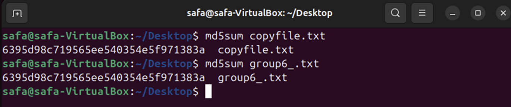

# System Forensics Project

**Author:** Safa Muhammad Ali  
**Course:** CSEC 140.602 – System Forensics  
**Institution:** RIT Dubai  
**Date:** 2026  

---

## Project Overview

This project demonstrates practical system forensics skills through hands-on tasks. The workflows cover:

1. Forensic file creation and integrity verification.  
2. Forensic deletion of files to prevent recovery.  
3. RAM (volatile memory) acquisition and analysis.  
4. USB drive imaging and recovery.  
5. Detecting and analyzing suspicious USB devices.

**Tools Used:**
- LiME (Linux Memory Extractor)  
- FTK Imager  
- xxd, dd, md5sum  
- USBDeview  
- Nano text editor  

---

## Workflow & Figures

### 1. Forensically Copying Files
**Figure 1a:** Creating a text file `group6_.txt` using `nano`.  

**Figure 1b:** Inserting content into `group6_.txt`.  

**Figure 1c:** Copying `group6_.txt` to `copyfile.txt` using `cp`.  

**Figure 1d:** Verifying integrity using `md5sum` hashes.  

---

### 2. Forensic Deletion
**Figure 2a:** Deleting files using `/dev/zero`.  

**Figure 2b:** Verifying deletion using binary view with `xxd`.  

---

### 3. RAM / Volatile Memory Analysis
**Figure 3a:** Dumping RAM using LiME module.  

**Figure 3b:** Searching RAM dump with `grep` to find sensitive data.  

---

### 4. USB Imaging / Windows Forensics
**Figure 4a:** Creating a USB image using FTK Imager.  

**Figure 4b:** Recovering deleted or hidden files from the USB image.  

---

### 5. Detecting Suspicious USB Devices
**Figure 5a:** Listing connected USB devices with USBDeview.  

---

## Conclusion

These figures document key forensic workflows, demonstrating practical cybersecurity capabilities:

- Maintaining forensic integrity of files.  
- Secure deletion of sensitive data.  
- Acquiring and analyzing volatile memory.  
- Imaging and recovering USB drives.  
- Detecting potentially malicious USB devices.

This project validates current practical cybersecurity skills and prepares for deeper specialization.
