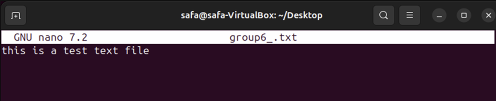
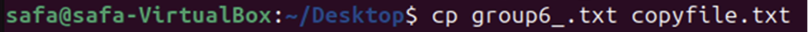
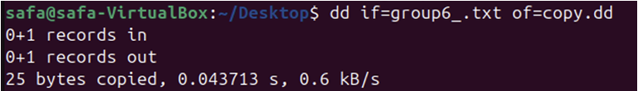
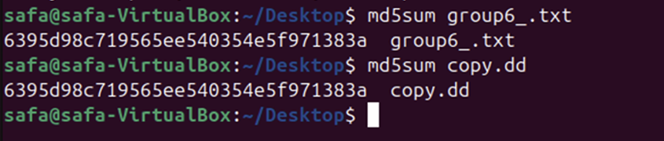
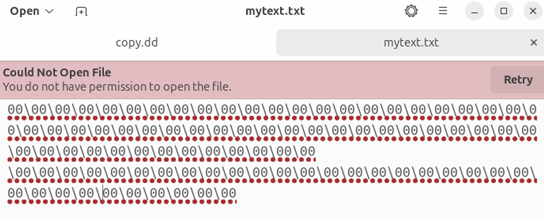
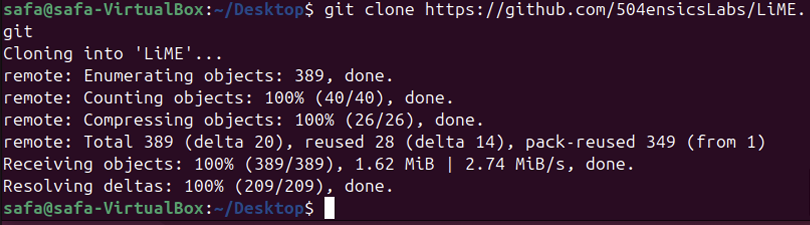
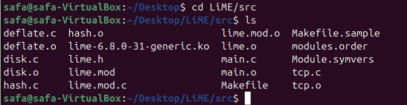
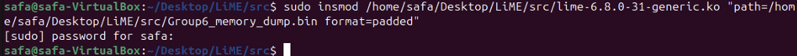
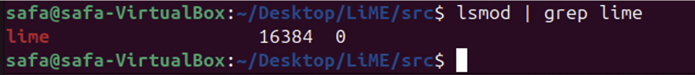
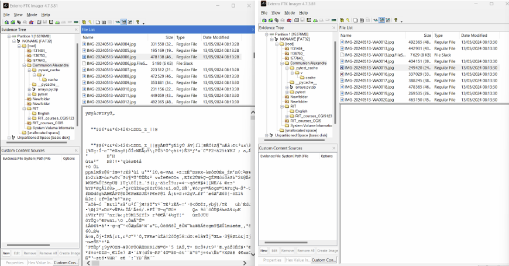

# System Forensics Project

**Author:** Safa Muhammad Ali  
**Course:** CSEC 140.602 – System Forensics  
**Institution:** RIT Dubai  
**Date:** 2026  

---

## Project Overview

This project demonstrates practical system forensics skills through hands-on tasks. The workflows cover:

1. Forensic file creation and integrity verification.  
2. Forensic deletion of files to prevent recovery.  
3. RAM (volatile memory) acquisition and analysis.  
4. USB drive imaging and recovery.  
5. Detecting and analyzing suspicious USB devices.

**Tools Used:**
- LiME (Linux Memory Extractor)  
- FTK Imager  
- xxd, dd, md5sum  
- USBDeview  
- Nano text editor  

---

## Workflow & Figures

### 1. Forensically Copying Files (Comparison)

**Figure 1a:** Creating a text file `group6_.txt` using `nano`.  
  
**Step-by-step:**
- Open terminal and type `nano group6_.txt` to create a new text file.  
- Enter some text content in the file and save it using `Ctrl+O` then `Ctrl+X`.  

**Figure 1b:** Inserting content into `group6_.txt`.  
  
**Step-by-step:**
- Edit the file to add additional content or modify existing content.  
- Save the changes with `Ctrl+O` and exit with `Ctrl+X`.  

**Figure 1c:** Copying with `cp` (normal copy).  
  
**Step-by-step:**
- Command: `cp group6_.txt copyfile.txt`  
- Normal copy; may not preserve metadata for forensic integrity.

**Figure 1c (dd):** Copying with `dd` (forensic copy).  
  
**Step-by-step:**
- Command: `dd if=group6_.txt of=copy.dd`  
- Creates a byte-by-byte forensic copy, preserving exact file content.

**Figure 1d:** Verifying integrity using `md5sum`.  
  
**Step-by-step:**
- Command: `md5sum group6_.txt copy.dd`  
- Confirm hashes match, showing `dd` copy is forensically identical.

---

### 2. Forensic Deletion

**Figure 2a:** Deleting files using `/dev/zero`.  
  
**Step-by-step:**
- Use `dd if=/dev/zero of=group6_.txt bs=1M count=1` to overwrite the file.  

**Figure 2b:** Confirming file content has been overwritten.  
  
**Step-by-step:**
- Open the file in a hex editor or using `xxd group6_.txt`.  
- Verify the file consists entirely of zeros, showing original data is unrecoverable.

---

### 3. RAM / Volatile Memory Analysis

**Figure 4a:** Cloning LiME from GitHub repository.  
  
**Step-by-step:**
- Run `git clone https://github.com/504ensicsLabs/LiME.git`  
- This downloads the LiME source code for memory acquisition.

**Figure 4b:** Listing contents of the `src` directory.  
  
**Step-by-step:**
- Navigate to `LiME/src` and list contents with `ls`.  
- Verify kernel module and source files are present before building.

**Figure 4c:** Inserting the kernel module and creating a RAM dump.  
  
**Step-by-step:**
- Load the module:  sudo insmod /home/safa/Desktop/LiME/src/lime-6.8.0-31-generic.ko "path=/home/safa/Desktop/LiME/src/Group6_memory_dump.bin format=padded"
  - This generates the memory dump file `Group6_memory_dump.bin`.

**Figure 4d:** Verifying module insertion and extracting readable strings.  
  
**Step-by-step:**
- Confirm module insertion: `lsmod | grep lime`  
- Extract readable strings:  strings Group6_memory_dump.bin > results.txt
  
---

### 4. USB Imaging / Windows Forensics

**Figure 5a:** Creating a USB image using FTK Imager.  
  
**Step-by-step:**
- Open FTK Imager, select USB drive, choose “Create Image”, and save as `.E01` or `.RAW`.

**Figure 5b:** Recovering deleted or hidden files from the USB image.  
  
**Step-by-step:**
- Mount image in FTK Imager.  
- Browse file system and export deleted/hidden files.

---

### 5. Detecting Suspicious USB Devices

**Figure 6a:** Listing connected USB devices with USBDeview.  
  
**Step-by-step:**
- Open USBDeview.  
- Check connected devices for unusual Vendor IDs, Product IDs, or suspicious activity.

---

## Conclusion

These figures and steps document key forensic workflows, demonstrating practical cybersecurity capabilities:

- Maintaining forensic integrity of files.  
- Secure deletion of sensitive data.  
- Acquiring and analyzing volatile memory.  
- Imaging and recovering USB drives.  
- Detecting potentially malicious USB devices.

This project validates current practical cybersecurity skills and prepares for deeper specialization.
