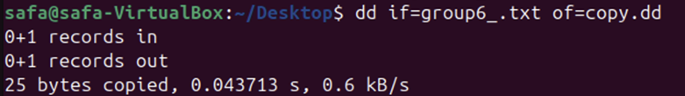
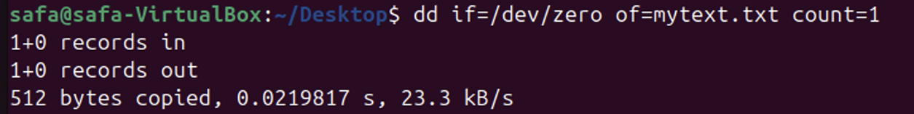
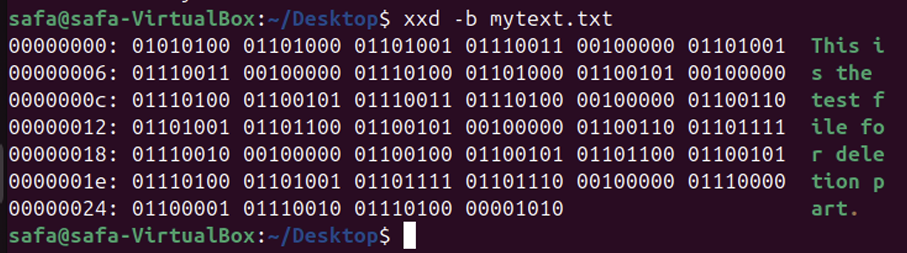
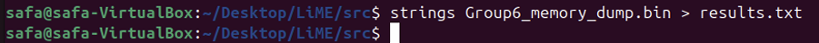
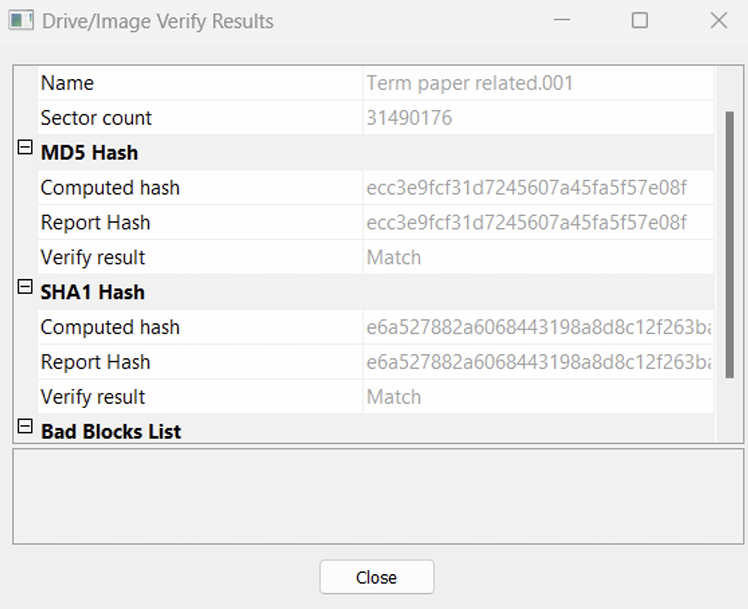
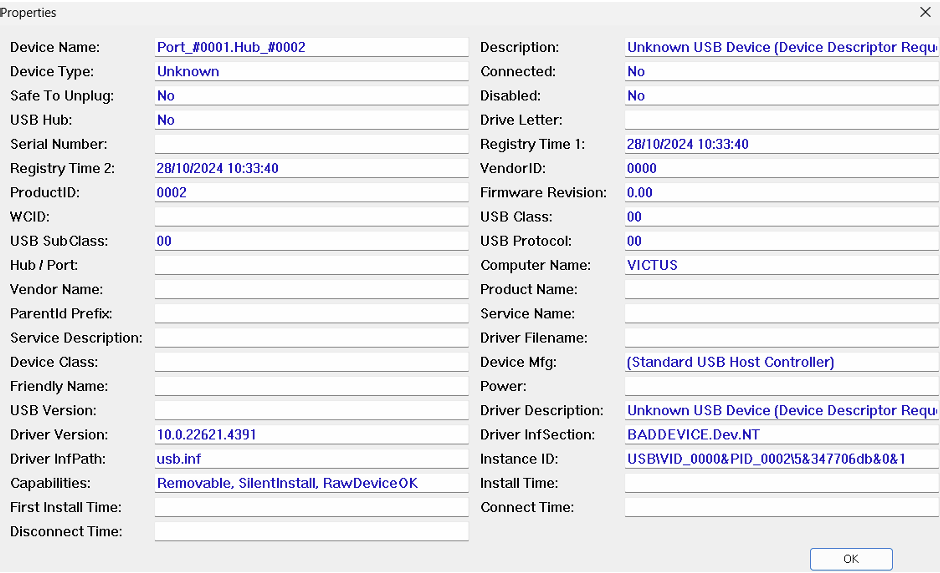

# System Forensics Project

**Author:** Safa Muhammad Ali  

---

## Project Overview

This project demonstrates practical system forensics skills, including:

- Forensic file copying and hash verification.
- Forensic deletion of files.
- RAM (volatile memory) acquisition and analysis.
- USB drive imaging and recovery.
- Detecting suspicious USB devices.

---

## Figures / Screenshots

### 1. Forensically Copying Files
**Figure 1a:** Creating a text file `group6_.txt` using `nano`.  

### 2. Forensic Deletion
**Figure 2a:** Deleting files using `/dev/zero` and verifying with `xxd`.  

### 3. RAM / Volatile Memory Analysis
**Figure 3a:** Dumping RAM using LiME module and searching with `grep`.  

### 4. USB Imaging / Windows Forensics
**Figure 4a:** Creating a USB image using FTK Imager.  

### 5. Detecting Suspicious USB Devices
**Figure 5a:** Listing connected USB devices and highlighting suspicious ones.  

---

## Conclusion

These screenshots document key forensic workflows, demonstrating practical capabilities in:

- Maintaining forensic integrity of files.
- Secure deletion of sensitive data.
- Acquiring and analyzing volatile memory.
- Imaging and recovering USB drives.
- Detecting potentially malicious USB devices.

This project validates current cybersecurity skills and prepares for deeper specialization.
